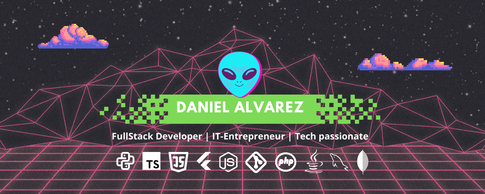

# Hola, Soy el Daz 🤘

### 👨🏻‍💻 &nbsp;About Me

🚀 &nbsp; Apasionado por la tecnología \
🎓 &nbsp; Ingeniero en informática \
🎸 &nbsp; En mis momentos libres toco la guitarra. \
🎮 &nbsp; Me gustan los videojuegos, más si se trata de la F1. \
🐶 &nbsp; PetLover forever.

### 🛠 &nbsp;Tech Stack

 

### ⚙️ &nbsp;GitHub Analytics

<a href="https://github.com/elquimeras">
  
  <! --- 
</a>

### 🤝🏻 &nbsp; Encuentrame:

